# Activation Functions

## Index

- [Functions](#functions)
    - [Sigmoid](#sigmoid)
    - [Tanh](#tanh)
    - [ReLU](#relu)
    - [Leaky ReLU](#leaky-relu)
    - [PReLU](#prelu)

- [Transformed Feature Spaces](#transformed-feature-spaces)
    - [Single Hidden Layer](#single-hidden-layer)
        - [Sigmoid](#transforming-with-sigmoid)
        - [Tanh](#transforming-with-tanh)
        - [ReLU](#transforming-with-relu)
        - [PReLU](#transforming-with-prelu)
    - [Two Hidden Layers](#two-hidden-layers)
        - [Tanh](#transforming-twice-with-tanh)
        - [PReLU](#transforming-twice-with-prelu)

## Functions

### Sigmoid

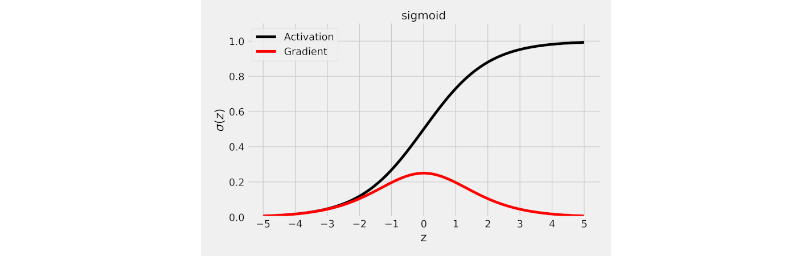
*Source: [Chapter 4](https://github.com/dvgodoy/PyTorchStepByStep/blob/master/Chapter04.ipynb)*

### Tanh

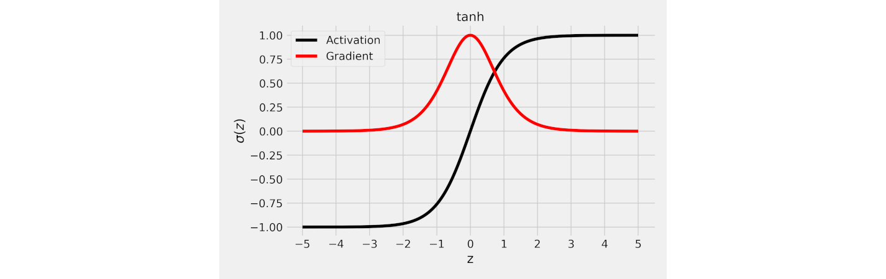
*Source: [Chapter 4](https://github.com/dvgodoy/PyTorchStepByStep/blob/master/Chapter04.ipynb)*

### ReLU

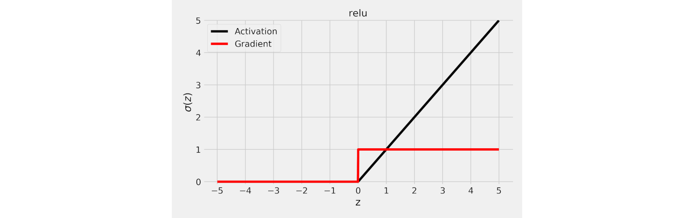
*Source: [Chapter 4](https://github.com/dvgodoy/PyTorchStepByStep/blob/master/Chapter04.ipynb)*

### Leaky ReLU

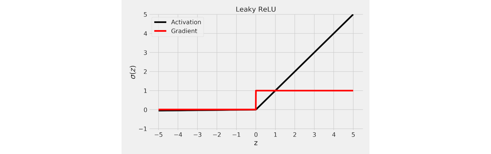
*Source: [Chapter 4](https://github.com/dvgodoy/PyTorchStepByStep/blob/master/Chapter04.ipynb)*

### Parametric ReLU (PReLU)

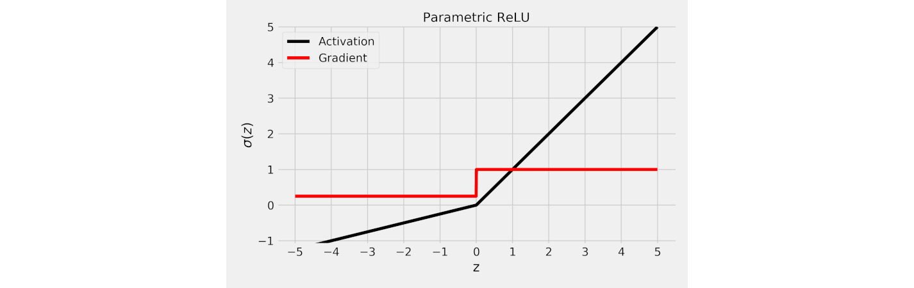
*Source: [Chapter 4](https://github.com/dvgodoy/PyTorchStepByStep/blob/master/Chapter04.ipynb)*

## Transformed Feature Spaces

### Single Hidden Layer

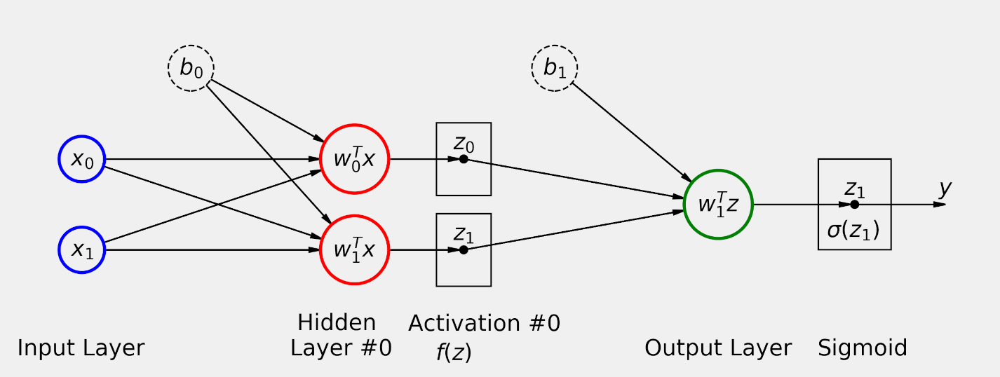
*Source: Chapter Bonus*

*Source: Chapter Bonus*

#### Transforming with Sigmoid

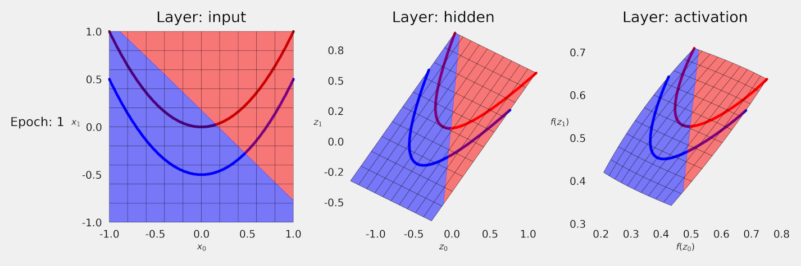
*Source: Chapter Bonus*

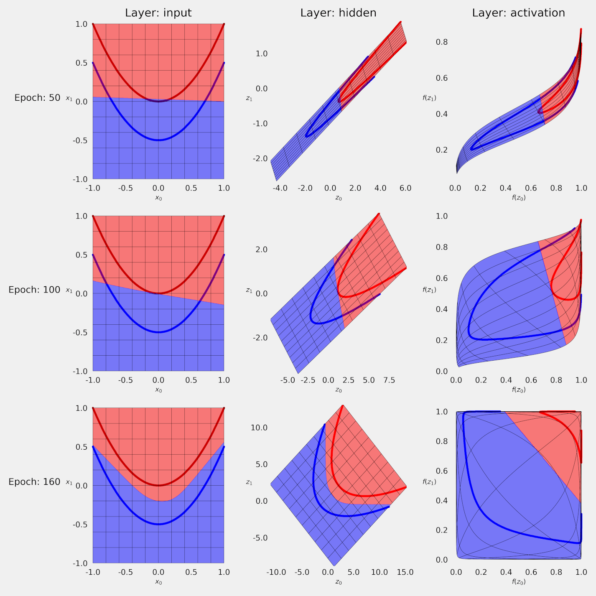
*Source: Chapter Bonus*

#### Transforming with Tanh

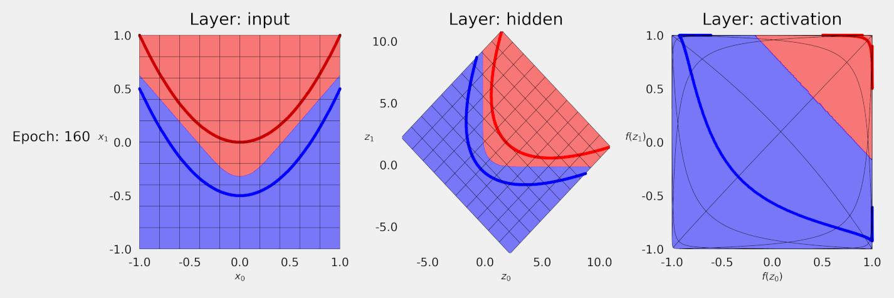
*Source: Chapter Bonus*

#### Transforming with ReLU

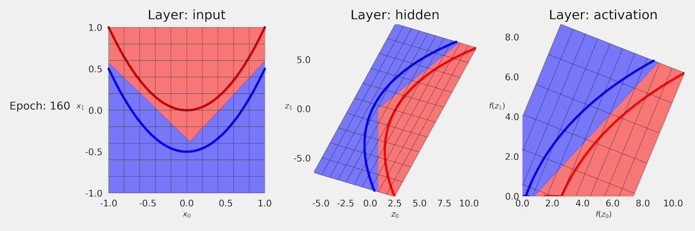
*Source: Chapter Bonus*

#### Transforming with PReLU

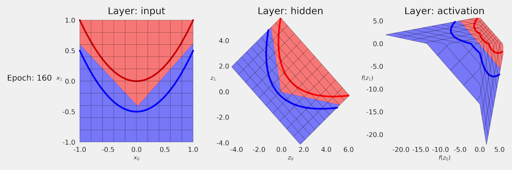
*Source: Chapter Bonus*

### Two Hidden Layers

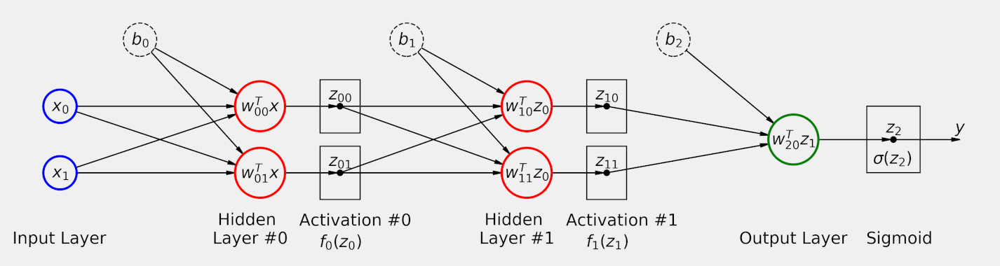
*Source: Chapter Bonus*

#### Transforming Twice with Tanh

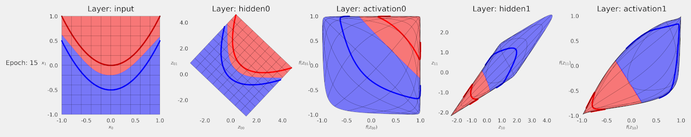
*Source: Chapter Bonus*

#### Transforming Twice with PReLU

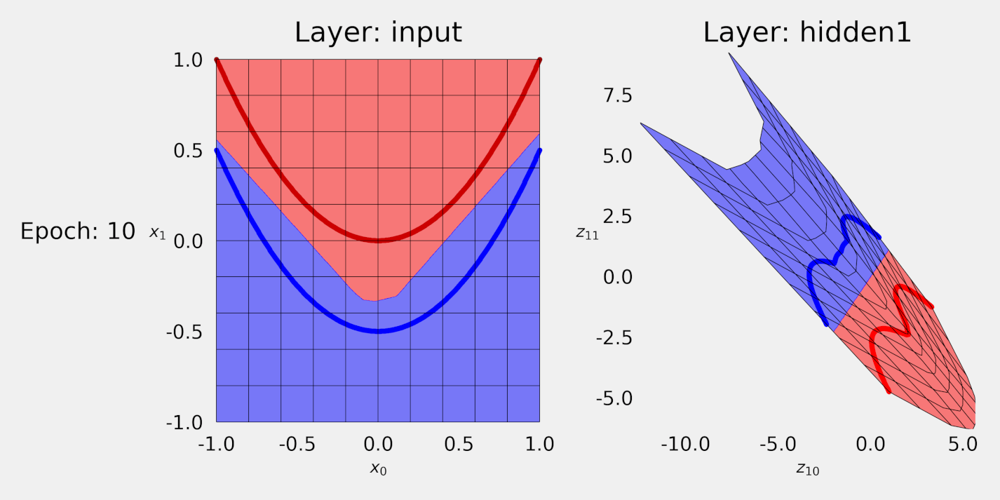
*Source: Chapter Bonus*