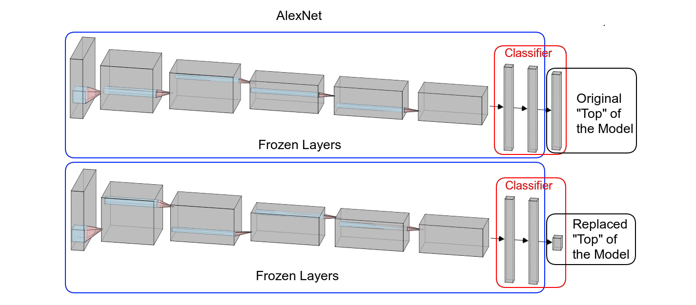
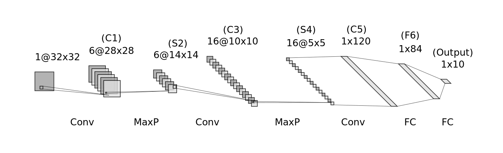
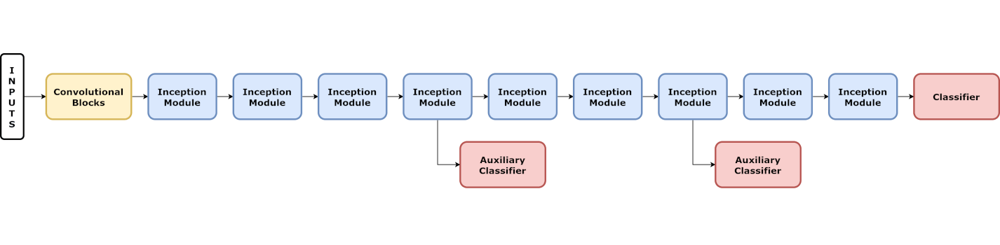
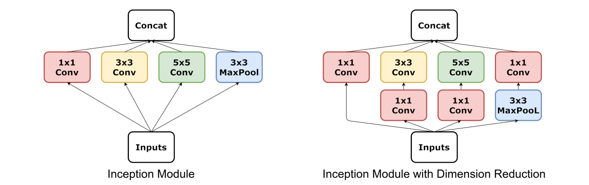

# Architectures

[Back](https://dvgodoy.github.io/dl-visuals)

## Index

- [Alexnet](#alexnet)
- [LeNet](#lenet)
- [Inception](#inception)
    - [Model](#inception-model)
    - [Modules](#inception-modules)
- [ResNet](#resnet)
    - [Residual Block](#residual-block)

### **** CLICK ON THE IMAGES FOR FULL SIZE ****

## Papers

- Alexnet: [ImageNet Classification with Deep Convolutional Neural Networks](https://papers.nips.cc/paper/2012/hash/c399862d3b9d6b76c8436e924a68c45b-Abstract.html) by Krizhevsky, A. et al. (2012)
- Lenet: [Gradient-based learning applied to document recognition](https://bit.ly/3sJ7Nn7) by LeCun, Y. et al. (1998)
- Inception: [Going Deeper with Convolutions](https://arxiv.org/abs/1409.4842) by Szegedy, C. et al. (2014)
- ResNet: [Deep Residual Learning for Image Recognition](https://arxiv.org/abs/1512.03385) by He, K. et al. (2015)

## Alexet

*Source: [Chapter 7](https://github.com/dvgodoy/PyTorchStepByStep/blob/master/Chapter07.ipynb)*

Generated using Alexander Lenail's [NN-SVG](http://alexlenail.me/NN-SVG/).

## LeNet

*Source: [Chapter 5](https://github.com/dvgodoy/PyTorchStepByStep/blob/master/Chapter05.ipynb)*

Generated using Alexander Lenail's [NN-SVG](http://alexlenail.me/NN-SVG/).

## Inception

### Inception Model

*Source: [Chapter 7](https://github.com/dvgodoy/PyTorchStepByStep/blob/master/Chapter07.ipynb)*

### Inception Modules

*Source: [Chapter 7](https://github.com/dvgodoy/PyTorchStepByStep/blob/master/Chapter07.ipynb)*

## ResNet

### Residual Block

*Source: [Chapter 7](https://github.com/dvgodoy/PyTorchStepByStep/blob/master/Chapter07.ipynb)*
