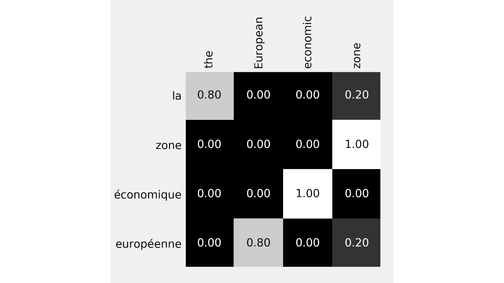
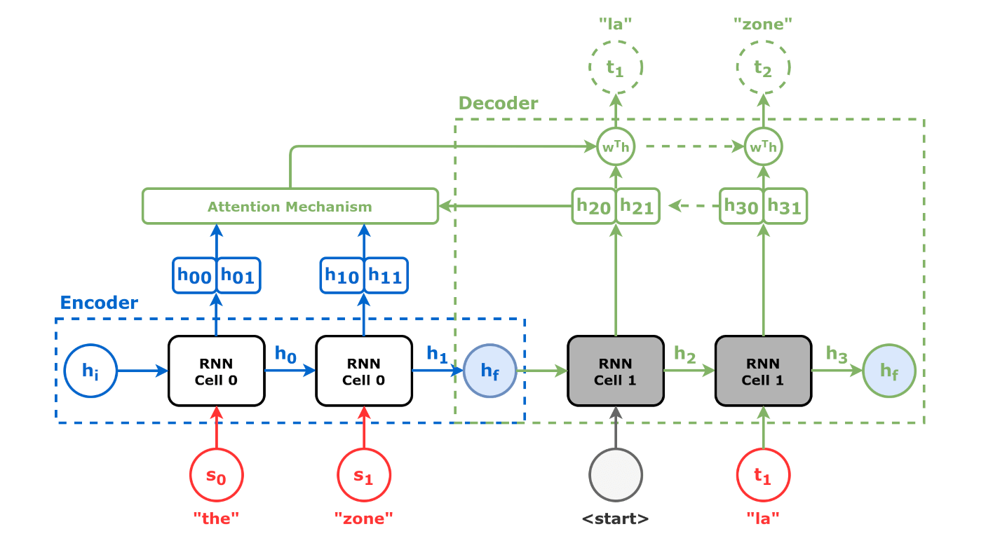

# Attention

## Index

- [Back](https://dvgodoy.github.io/dl-visuals)
- [Attention](#attention)
	- [Scaled Dot Product](#scaled-dot-product)
	    - [Alignment Scores](#alignment-scores)
	    - [Context Vector](#context-vector)
	    - [Translation Example](#translation-example)
	- [Cross-Attention](#cross-attention)
	    - [Encoder + Decoder + Cross-Attention](#encoder+decoder+cross-attention)
	- [Multi-Headed Attention](#multi-headed-attention)
	    - [Wide](#wide-attention)
	    - [Narrow](#narrow-attention)
- [Self-Attention](#self-attention)
    - [Encoder](#encoder)
    - [Decoder](#decoder)
    - [Encoder+Decoder](#decoder)

### **** CLICK ON THE IMAGES FOR FULL SIZE ****

## Papers

- Encoder-Decoder Architecture: [Sequence to Sequence Learning with Neural Networks](https://papers.nips.cc/paper/2014/hash/a14ac55a4f27472c5d894ec1c3c743d2-Abstract.html) by Sutskever, I. et al. (2014)
- Scaled Dot Product / Self-Attention: [Attention Is All You Need](https://arxiv.org/abs/1706.03762) by Vaswani, A. et al. (2017)

## Attention

### Scaled Dot Product

*Source: [Chapter 9](https://github.com/dvgodoy/PyTorchStepByStep/blob/master/Chapter09.ipynb)*

#### Alignment Scores

*Source: [Chapter 9](https://github.com/dvgodoy/PyTorchStepByStep/blob/master/Chapter09.ipynb)*

#### Context Vector

*Source: [Chapter 9](https://github.com/dvgodoy/PyTorchStepByStep/blob/master/Chapter09.ipynb)*

*Source: [Chapter 9](https://github.com/dvgodoy/PyTorchStepByStep/blob/master/Chapter09.ipynb)*

### Cross-Attention

*Source: [Chapter 9](https://github.com/dvgodoy/PyTorchStepByStep/blob/master/Chapter09.ipynb)*

*Source: [Chapter 9](https://github.com/dvgodoy/PyTorchStepByStep/blob/master/Chapter09.ipynb)*

#### Encoder+Decoder+Cross-Attention

*Source: [Chapter 9](https://github.com/dvgodoy/PyTorchStepByStep/blob/master/Chapter09.ipynb)*

#### Translation Example

*Source: [Chapter 9](https://github.com/dvgodoy/PyTorchStepByStep/blob/master/Chapter09.ipynb)*

*Source: [Chapter 9](https://github.com/dvgodoy/PyTorchStepByStep/blob/master/Chapter09.ipynb)*

*Source: [Chapter 9](https://github.com/dvgodoy/PyTorchStepByStep/blob/master/Chapter09.ipynb)*

*Source: [Chapter 9](https://github.com/dvgodoy/PyTorchStepByStep/blob/master/Chapter09.ipynb)*

*Source: [Chapter 9](https://github.com/dvgodoy/PyTorchStepByStep/blob/master/Chapter09.ipynb)*

### Multi-Headed Attention

*Source: [Chapter 9](https://github.com/dvgodoy/PyTorchStepByStep/blob/master/Chapter09.ipynb)*

#### Wide Attention

*Source: [Chapter 9](https://github.com/dvgodoy/PyTorchStepByStep/blob/master/Chapter09.ipynb)*

#### Narrow Attention

*Source: [Chapter 10](https://github.com/dvgodoy/PyTorchStepByStep/blob/master/Chapter10.ipynb)*

*Source: [Chapter 10](https://github.com/dvgodoy/PyTorchStepByStep/blob/master/Chapter10.ipynb)*

*Source: [Chapter 10](https://github.com/dvgodoy/PyTorchStepByStep/blob/master/Chapter10.ipynb)*

## Self-Attention

### Encoder

*Source: [Chapter 9](https://github.com/dvgodoy/PyTorchStepByStep/blob/master/Chapter09.ipynb)*

*Source: [Chapter 9](https://github.com/dvgodoy/PyTorchStepByStep/blob/master/Chapter09.ipynb)*

*Source: [Chapter 9](https://github.com/dvgodoy/PyTorchStepByStep/blob/master/Chapter09.ipynb)*

*Source: [Chapter 10](https://github.com/dvgodoy/PyTorchStepByStep/blob/master/Chapter10.ipynb)*

### Decoder

*Source: [Chapter 9](https://github.com/dvgodoy/PyTorchStepByStep/blob/master/Chapter09.ipynb)*

*Source: [Chapter 9](https://github.com/dvgodoy/PyTorchStepByStep/blob/master/Chapter09.ipynb)*

*Source: [Chapter 10](https://github.com/dvgodoy/PyTorchStepByStep/blob/master/Chapter10.ipynb)*

### Encoder+Decoder

*Source: [Chapter 9](https://github.com/dvgodoy/PyTorchStepByStep/blob/master/Chapter09.ipynb)*